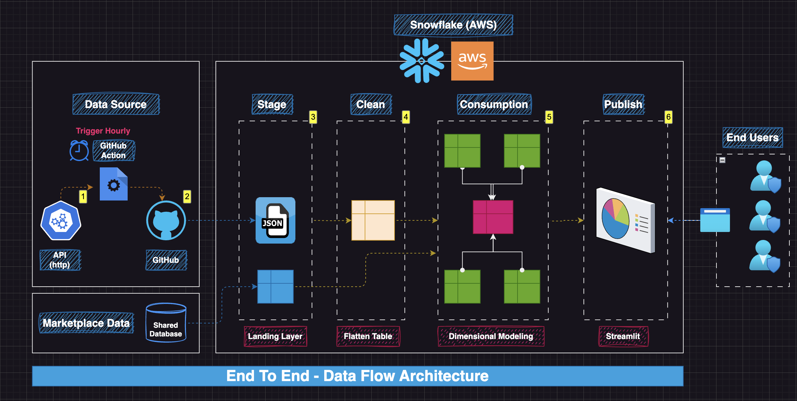

---

# **End-to-End Data Flow Architecture Using Snowflake**

## **Overview**
This project demonstrates a complete data pipeline built on **Snowflake Cloud Data Warehouse**, following a layered architecture. The system automates data ingestion, transformation, and reporting, utilizing tools like **GitHub Actions**, **API sources**, and **Snowflake's native features**. The architecture ensures clean, reliable, and timely data for business insights through dashboards.

---

## **Architecture Flow**

The architecture consists of multiple stages, including source ingestion, staging, data cleansing, consumption, and publishing for visualization.  

### **Layers Overview**
1. **Data Source**  
   - Ingests data from multiple sources (API endpoints, external data sources like JSON, CSV, XML, etc.).  
   - Marketplace data (shared Snowflake databases) is also integrated.  
   - Automated data retrieval is triggered hourly via **GitHub Actions**.

2. **Stage Layer (Bronze)**  
   - Raw, unprocessed data is landed here.  
   - Files like JSON are directly copied into this layer without transformations.  
   - Example Table: `Raw_AQI_Table`.

3. **Clean Layer (Silver)**  
   - Data undergoes transformations such as flattening and normalization.  
   - Example transformations: breaking down nested JSON structures.  
   - Example Table: `Clean_AQI_Table`.

4. **Consumption Layer (Gold)**  
   - Data is structured into facts and dimensions for analytical queries.  
   - Dimensional modeling is applied here.  
   - Example Tables:
     - Fact Table: `AQI_Fact`
     - Dimension Tables: `Location_Dimension`, `Date_Dimension`.

5. **Publish Layer**  
   - Processed data is served to end users through interactive dashboards built with **Streamlit**.

---

## **Data Flow Components**
![ALT TEXT] (part-01/Part01-Sec03-Diagram-02.png)
### **1. Ingestion & Automation**
- APIs and other external data sources are pulled periodically.
- **GitHub Actions** orchestrates the automated triggers for data ingestion.
  
### **2. Data Transformation**
- Snowflake performs multiple transformations, including flattening complex JSON structures.
- Tables are organized into:
  - **Stage Tables** (raw ingestion)
  - **Clean Tables** (transformed data)
  - **Fact and Dimension Tables** (ready for analytics)

### **3. Data Visualization**
- Dashboards are created using **Streamlit**.
- Users can interact with real-time metrics and reports.

---

## **Key Tables**
| Table Name           | Layer         | Description                                  |
|----------------------|---------------|----------------------------------------------|
| Raw_AQI_Table        | Stage         | Raw air quality data ingested from source.   |
| Clean_AQI_Table      | Clean         | Transformed data with structured fields.     |
| Flatten_AQI_Table    | Clean         | Flattened version of the AQI data.           |
| AQI_Fact             | Consumption   | Fact table for analytical queries.           |
| Location_Dimension   | Consumption   | Dimension table for geographic information.  |
| Date_Dimension       | Consumption   | Time dimension for date-based analysis.      |

---

## **Technologies Used**
- **Snowflake Cloud Data Warehouse**  
- **GitHub Actions** (for automated ingestion)  
- **Streamlit** (for visualization)  
- **Snowpark (Python)** (for pipeline automation and orchestration)  

---
